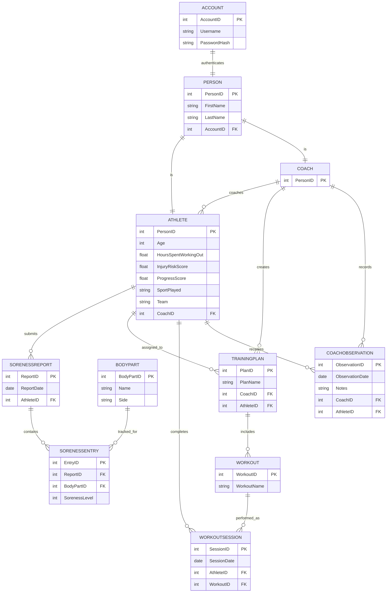

# Athlete Performance Tracking System  
## Entity Relationship Diagram

This document contains the ER diagram for the commercial athlete tracking system.

---

---

## Relational Schema
ACCOUNT (AccountID [PK], Username [Unique], PasswordHash) 
PERSON (PersonID [PK], FirstName, LastName, DateOfBirth, AccountID [FK]) 
ATHLETE (PersonID [PK, FK to Person], HoursSpentWorkingOut, SportPlayed, Team) 
COACH (PersonID [PK, FK to Person]) 
BODYPART (BodyPartID [PK], Name, Side) 
WORKOUT (WorkoutID [PK], WorkoutName, BodyPartID [FK]) 
ATHLETE_COACH (AthletePersonID [PK, FK], CoachPersonID [PK, FK], StartDate [PK], EndDate) 
SORENESS_REPORT (ReportID [PK], ReportDate, AthletePersonID [FK]) 
SORENESS_ENTRY (EntryID [PK], ReportID [FK], BodyPartID [FK], SorenessLevel) 
TRAINING_PLAN (PlanID [PK], PlanName, CoachPersonID [FK], AthletePersonID [FK]) 
PLAN_WORKOUT (PlanID [PK, FK for Training_Plan], WorkoutID [PK, FK for Workout], OrderIndex, Sets, Reps, DurationMinutes, Notes) 
WORKOUT_SESSION (SessionID [PK], SessionDate, AthletePersonID [FK], WorkoutID [FK], Notes) 
COACH_OBSERVATION (ObservationID [PK], ObservationDate, Notes, CoachPersonID [FK], AthletePersonID [FK]) 
ATHLETE_SCORE_HISTORY (ScoreID [PK], AthletePersonID [FK], ScoreDate, InjuryRiskScore, ProgressScore, ModelVersion, Notes) 

## Notes

- The system is designed for a commercial athlete tracking platform.
- Workouts and training plans use a many-to-many relationship via a junction table.
- The schema follows Third Normal Form (3NF).
