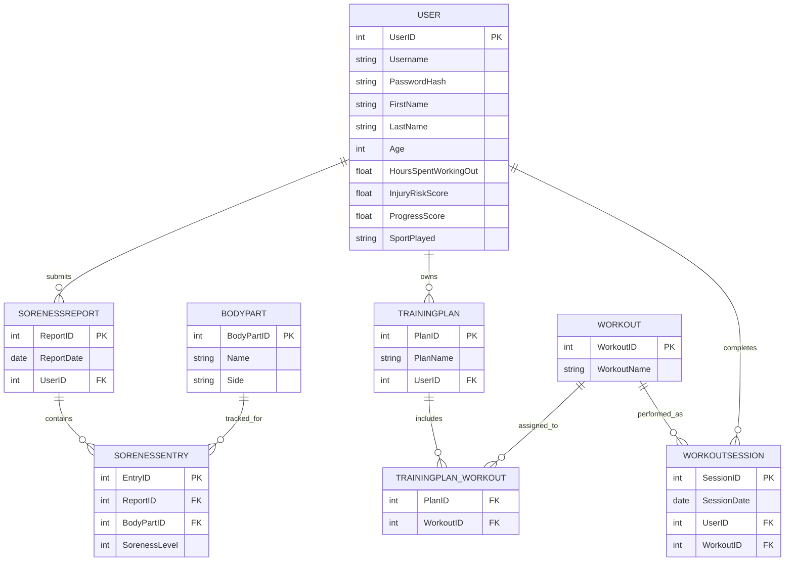

# Athlete Performance Tracking System  
## Entity Relationship Diagram

This document contains the ER diagram for the commercial athlete tracking system.

---

---

## Notes

- The system is designed for a commercial athlete tracking platform.
- Coaches are not modeled as entities; insights are system-generated.
- Workouts and training plans use a many-to-many relationship via a junction table.
- The schema follows Third Normal Form (3NF).
