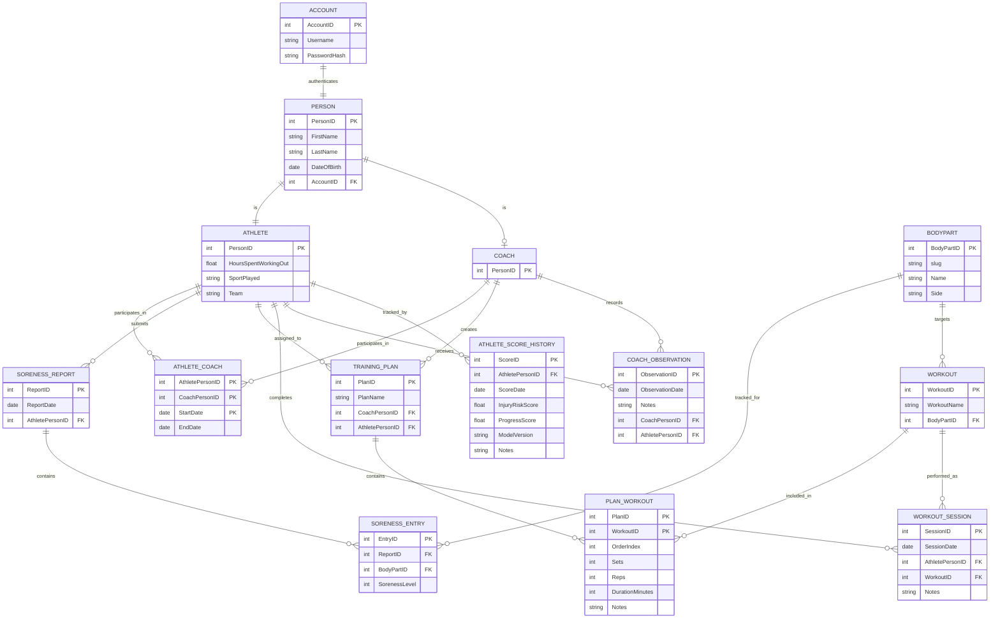

# Athlete Performance Tracking System
## Entity Relationship Diagram

This document contains the ER diagram for the commercial athlete tracking system.

---

```mermaid
erDiagram

    ACCOUNT {
        int AccountID PK
        string Username
        string PasswordHash
    }

    PERSON {
        int PersonID PK
        string FirstName
        string LastName
        date DateOfBirth
        int AccountID FK
    }

    ATHLETE {
        int PersonID PK
        float HoursSpentWorkingOut
        string SportPlayed
        string Team
    }

    COACH {
        int PersonID PK
    }

    ATHLETE_COACH {
        int AthletePersonID PK
        int CoachPersonID PK
        date StartDate PK
        date EndDate
    }

    BODYPART {
        int BodyPartID PK
        string slug
        string Name
        string Side
    }

    WORKOUT {
        int WorkoutID PK
        string WorkoutName
        int BodyPartID FK
    }

    SORENESS_REPORT {
        int ReportID PK
        date ReportDate
        int AthletePersonID FK
    }

    SORENESS_ENTRY {
        int EntryID PK
        int ReportID FK
        int BodyPartID FK
        int SorenessLevel
    }

    TRAINING_PLAN {
        int PlanID PK
        string PlanName
        int CoachPersonID FK
        int AthletePersonID FK
    }

    PLAN_WORKOUT {
        int PlanID PK
        int WorkoutID PK
        int OrderIndex
        int Sets
        int Reps
        int DurationMinutes
        string Notes
    }

    WORKOUT_SESSION {
        int SessionID PK
        date SessionDate
        int AthletePersonID FK
        int WorkoutID FK
        string Notes
    }

    COACH_OBSERVATION {
        int ObservationID PK
        date ObservationDate
        string Notes
        int CoachPersonID FK
        int AthletePersonID FK
    }

    ATHLETE_SCORE_HISTORY {
        int ScoreID PK
        int AthletePersonID FK
        date ScoreDate
        float InjuryRiskScore
        float ProgressScore
        string ModelVersion
        string Notes
    }

    ACCOUNT ||--|| PERSON : authenticates
    PERSON ||--|| ATHLETE : is
    PERSON ||--o| COACH : is

    ATHLETE ||--o{ ATHLETE_COACH : participates_in
    COACH ||--o{ ATHLETE_COACH : participates_in

    ATHLETE ||--o{ SORENESS_REPORT : submits
    SORENESS_REPORT ||--o{ SORENESS_ENTRY : contains
    BODYPART ||--o{ SORENESS_ENTRY : tracked_for
    BODYPART ||--o{ WORKOUT : targets

    COACH ||--o{ TRAINING_PLAN : creates
    ATHLETE ||--o{ TRAINING_PLAN : assigned_to
    TRAINING_PLAN ||--o{ PLAN_WORKOUT : contains
    WORKOUT ||--o{ PLAN_WORKOUT : included_in

    ATHLETE ||--o{ WORKOUT_SESSION : completes
    WORKOUT ||--o{ WORKOUT_SESSION : performed_as

    COACH ||--o{ COACH_OBSERVATION : records
    ATHLETE ||--o{ COACH_OBSERVATION : receives

    ATHLETE ||--o{ ATHLETE_SCORE_HISTORY : tracked_by
```

---

## Relational Schema

### Phase 1 — Full ORM with relationships
- **ACCOUNT** (AccountID [PK], Username [Unique, NOT NULL], PasswordHash [NOT NULL])
- **PERSON** (PersonID [PK], FirstName, LastName, DateOfBirth, AccountID [FK → ACCOUNT, Unique])
- **ATHLETE** (PersonID [PK, FK → PERSON, CASCADE DELETE], HoursSpentWorkingOut, SportPlayed, Team)
- **BODYPART** (BodyPartID [PK], slug [Unique, NOT NULL], Name [NOT NULL], Side; UNIQUE(Name, Side))
- **WORKOUT** (WorkoutID [PK], WorkoutName [NOT NULL], BodyPartID [FK → BODYPART])
- **SORENESS_REPORT** (ReportID [PK], ReportDate [NOT NULL], AthletePersonID [FK → ATHLETE])
- **SORENESS_ENTRY** (EntryID [PK], ReportID [FK], BodyPartID [FK], SorenessLevel [CHECK 0–10]; UNIQUE(ReportID, BodyPartID))
- **TRAINING_PLAN** (PlanID [PK], PlanName [NOT NULL], CoachPersonID [FK → COACH, nullable], AthletePersonID [FK → ATHLETE, nullable])
- **PLAN_WORKOUT** (PlanID [PK, FK → TRAINING_PLAN], WorkoutID [PK, FK → WORKOUT], OrderIndex, Sets, Reps, DurationMinutes, Notes)
- **ATHLETE_SCORE_HISTORY** (ScoreID [PK], AthletePersonID [FK → ATHLETE], ScoreDate [NOT NULL], InjuryRiskScore, ProgressScore, ModelVersion, Notes)

### Phase 2 — Stub tables (columns defined, no ORM relationships wired yet)
- **COACH** (PersonID [PK, FK → PERSON])
- **ATHLETE_COACH** (AthletePersonID [PK, FK → ATHLETE], CoachPersonID [PK, FK → COACH], StartDate [PK], EndDate)
- **WORKOUT_SESSION** (SessionID [PK], SessionDate, AthletePersonID [FK → ATHLETE], WorkoutID [FK → WORKOUT], Notes)
- **COACH_OBSERVATION** (ObservationID [PK], ObservationDate, Notes, CoachPersonID [FK → COACH], AthletePersonID [FK → ATHLETE])

---

## Notes

- Schema follows Third Normal Form (3NF).
- InjuryRiskScore and ProgressScore are moved out of ATHLETE into ATHLETE_SCORE_HISTORY to track model predictions over time.
- BODYPART includes a `slug` column (e.g. `upper-back`) sourced from `BodyMap.tsx` for frontend–backend alignment.
- ATHLETE_COACH replaces a direct FK on ATHLETE, allowing many-to-many coach relationships with temporal tracking.
- PLAN_WORKOUT is a junction table between TRAINING_PLAN and WORKOUT with prescription metadata (sets/reps/duration).
