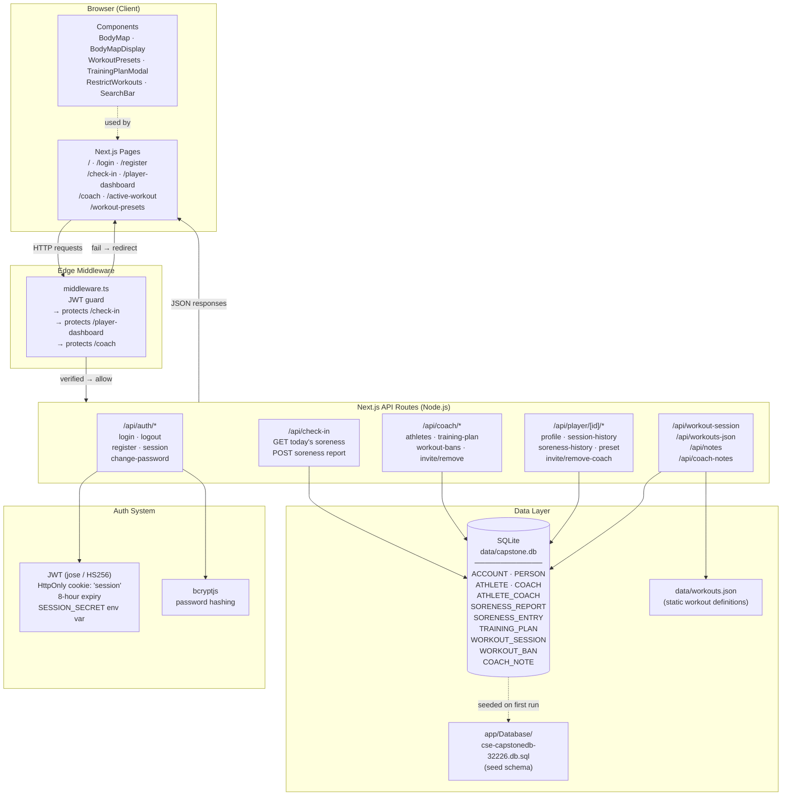

# WEAVESTREAM — System Diagram

## Key Architectural Decisions

| Concern | Solution |
|---|---|
| Auth | Custom JWT via `jose`; no NextAuth |
| Database | Embedded SQLite (`better-sqlite3`, WAL mode) — no external DB |
| Route protection | Edge middleware JWT verification |
| Styling | Tailwind CSS v4 |
| 3D / SVG bodies | `@react-three/fiber` + inline SVG wrappers |
| Charts | `recharts` |
| Password security | `bcryptjs` |
